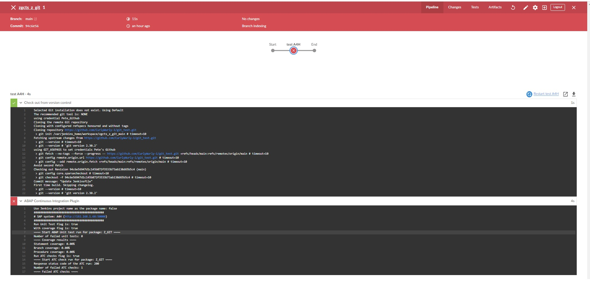

# git_abapCI_jenkinsfile

This repo is for setting up a Jenkins Pipeline to test ABAP objects by package.

To use this, do the following:

 - In ABAP
   - Create a package called "Z_GIT"
   - In package "Z_GIT", create an abap program called "ZTX001" with the code seen below. N.B. This code is designed to fail an ATC check
     - REPORT ZTX001.
     - TABLES usr05.
     - SELECT * FROM usr05.
     - ENDSELECT.
     - WRITE: / 'Hello'.
     - start-of-selection.
     - WRITE: / 'start'.

 - In Docker
   - Install Jenkins
   - Execute Jenkins (note URL for Jenkins)

 - In a Browser 
   - Enter URL for Jenkins
   - Login to Jenkins
   - Click "Manage Jenkins" -> "Manage Plugins" and install "Abap Continuous Integration Plugin"

 - In Docker
   - Stop Jenkins
   - Restart Jenkins

 - In a Browser 
   - Enter URL for Jenkins
   - Login to Jenkins
   - Click "Manage Jenkins" -> "Configure System", page down to the "Abap Ci Plugin" section and add your SAP system  
   - Go back to main "Dashboard"
   - Click "New Item"
     - In "item name", Enter "zgcts_z_git" (where "z_git" is the package you want to test)
     - Select "Multibranch Pipeline"
     - Press "OK"
     - In next screen
       - In "Display Name", enter "zgcts_z_git" 
       - In section "Branch Sources" press "Add source"->"Github" and populate "Repository HTTPS URL" with this repo url e.g. "https://github.com/CurlyWurly-1/git_abapCI_jenkinsfile.git"
       - Press "save"
   - Go back to main "Dashboard"
   - Click "OpenBlue Ocean"
   - Click on "zgcts_z_git", click on the run and you will get something like the following page 

 - In ABAP
   - Execute ABAP program SATC_UI_RUN_MONITOR
   - Highlight line that says "Z_GIT"
   - Press the button "result" and you will see more detail on the error(s)
